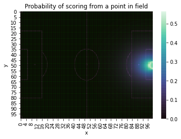
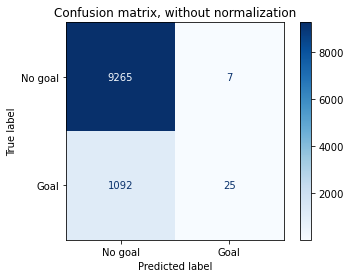
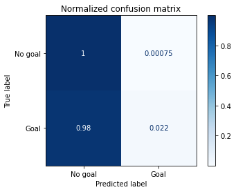
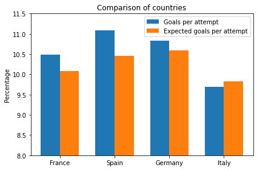

```python
#Load libraries

import numpy as np
import pandas as pd
import math
import random
import sklearn

from sklearn.linear_model import LogisticRegression
from sklearn.model_selection import train_test_split
from sklearn.metrics import accuracy_score
from sklearn.model_selection import train_test_split #Data split function
from sklearn.metrics import confusion_matrix
from sklearn.metrics import plot_confusion_matrix

```


```python
#This notebook is second version the project. The original data was not available, so we'll convert our data to a format that resembles the original data.
#The script inside of the first for loop modified from https://github.com/Friends-of-Tracking-Data-FoTD/SoccermaticsForPython/blob/master/3xGModel.py


def minimal_data(df):
    
    train = pd.DataFrame(df)
    pd.unique(train['subEventName'])
    shots=train[train['subEventName']=='Shot']
    minimal_df=pd.DataFrame(columns=['goal','x','y'])

    for i,shot in shots.iterrows():
    
        stop=0       
        if not(stop):        
            minimal_df.at[i,'x']=100-shot['positions'][0]['x']
            minimal_df.at[i,'y']=shot['positions'][0]['y']

            #Was it a goal
            minimal_df.at[i,'goal']=0
            for shottags in shot['tags']:
                    #Tags contain that its a goal
                    if shottags['id']==101:
                        minimal_df.at[i,'goal']=1
                        
            for shottags in shot['tags']:
                    if shottags['id']==403:
                        minimal_df.at[i,'head']=1
                        minimal_df.at[i,'foot']=0

                    else:
                        minimal_df.at[i,'head']=0
                        minimal_df.at[i,'foot']=1

                        
    minimal_df['x'] = minimal_df['x'].astype('int64')
    minimal_df['y'] = minimal_df['y'].astype('int64')
    minimal_df['goal'] = minimal_df['goal'].astype('int64')

    #Mirror X-coordinates if the shot is from the side X < 50
    
    counter = 0
    xnormal = minimal_df['x'].tolist()
    xmirror = []
    for i in range(len(xnormal)):
        f = 0        
        x=xnormal[counter]
        if x < 50:
            f = 100 - x
        else:
            f = x
        xmirror.append(f)
        counter = counter + 1
    
    del minimal_df['x']
    minimal_df['x'] = xmirror


    return(minimal_df[['x','y','goal','head','foot']])

```

# Load data


```python
shots_euro_champ = minimal_data(pd.read_json('data/events_European_Championship.json'))
print('shots_euro_champ done')
shots_france = minimal_data(pd.read_json('data/events_France.json'))
print('shots_france done')
shots_germany = minimal_data(pd.read_json('data/events_Germany.json'))
print('shots_germany done')
shots_italy = minimal_data(pd.read_json('data/events_Italy.json'))
print('shots_italy done')
shots_spain = minimal_data(pd.read_json('data/events_Spain.json'))
print('shots_spain done')
shots_world_cup = minimal_data(pd.read_json('data/events_World_Cup.json'))

```

    shots_euro_champ done
    shots_france done
    shots_germany done
    shots_italy done
    shots_spain done


```python
shots_france.head()
```


<div>
<style scoped>
    .dataframe tbody tr th:only-of-type {
        vertical-align: middle;
    }

    .dataframe tbody tr th {
        vertical-align: top;
    }

    .dataframe thead th {
        text-align: right;
    }
</style>
<table border="1" class="dataframe">
  <thead>
    <tr style="text-align: right;">
      <th></th>
      <th>x</th>
      <th>y</th>
      <th>goal</th>
      <th>head</th>
      <th>foot</th>
    </tr>
  </thead>
  <tbody>
    <tr>
      <th>213</th>
      <td>94</td>
      <td>57</td>
      <td>1</td>
      <td>0.0</td>
      <td>1.0</td>
    </tr>
    <tr>
      <th>302</th>
      <td>83</td>
      <td>42</td>
      <td>0</td>
      <td>0.0</td>
      <td>1.0</td>
    </tr>
    <tr>
      <th>498</th>
      <td>96</td>
      <td>43</td>
      <td>1</td>
      <td>0.0</td>
      <td>1.0</td>
    </tr>
    <tr>
      <th>577</th>
      <td>84</td>
      <td>21</td>
      <td>0</td>
      <td>0.0</td>
      <td>1.0</td>
    </tr>
    <tr>
      <th>629</th>
      <td>73</td>
      <td>51</td>
      <td>0</td>
      <td>0.0</td>
      <td>1.0</td>
    </tr>
  </tbody>
</table>
</div>


```python
shots_germany.head()
```


<div>
<style scoped>
    .dataframe tbody tr th:only-of-type {
        vertical-align: middle;
    }

    .dataframe tbody tr th {
        vertical-align: top;
    }

    .dataframe thead th {
        text-align: right;
    }
</style>
<table border="1" class="dataframe">
  <thead>
    <tr style="text-align: right;">
      <th></th>
      <th>x</th>
      <th>y</th>
      <th>goal</th>
      <th>head</th>
      <th>foot</th>
    </tr>
  </thead>
  <tbody>
    <tr>
      <th>104</th>
      <td>83</td>
      <td>66</td>
      <td>0</td>
      <td>0.0</td>
      <td>1.0</td>
    </tr>
    <tr>
      <th>178</th>
      <td>95</td>
      <td>59</td>
      <td>1</td>
      <td>0.0</td>
      <td>1.0</td>
    </tr>
    <tr>
      <th>216</th>
      <td>91</td>
      <td>66</td>
      <td>0</td>
      <td>0.0</td>
      <td>1.0</td>
    </tr>
    <tr>
      <th>220</th>
      <td>88</td>
      <td>49</td>
      <td>0</td>
      <td>0.0</td>
      <td>1.0</td>
    </tr>
    <tr>
      <th>313</th>
      <td>74</td>
      <td>42</td>
      <td>0</td>
      <td>0.0</td>
      <td>1.0</td>
    </tr>
  </tbody>
</table>
</div>


```python
shots_italy.head()
```


<div>
<style scoped>
    .dataframe tbody tr th:only-of-type {
        vertical-align: middle;
    }

    .dataframe tbody tr th {
        vertical-align: top;
    }

    .dataframe thead th {
        text-align: right;
    }
</style>
<table border="1" class="dataframe">
  <thead>
    <tr style="text-align: right;">
      <th></th>
      <th>x</th>
      <th>y</th>
      <th>goal</th>
      <th>head</th>
      <th>foot</th>
    </tr>
  </thead>
  <tbody>
    <tr>
      <th>68</th>
      <td>80</td>
      <td>41</td>
      <td>0</td>
      <td>0.0</td>
      <td>1.0</td>
    </tr>
    <tr>
      <th>90</th>
      <td>95</td>
      <td>33</td>
      <td>0</td>
      <td>0.0</td>
      <td>1.0</td>
    </tr>
    <tr>
      <th>213</th>
      <td>72</td>
      <td>63</td>
      <td>0</td>
      <td>0.0</td>
      <td>1.0</td>
    </tr>
    <tr>
      <th>426</th>
      <td>91</td>
      <td>62</td>
      <td>0</td>
      <td>0.0</td>
      <td>1.0</td>
    </tr>
    <tr>
      <th>435</th>
      <td>86</td>
      <td>26</td>
      <td>0</td>
      <td>0.0</td>
      <td>1.0</td>
    </tr>
  </tbody>
</table>
</div>


```python
shots_spain.head()
```


<div>
<style scoped>
    .dataframe tbody tr th:only-of-type {
        vertical-align: middle;
    }

    .dataframe tbody tr th {
        vertical-align: top;
    }

    .dataframe thead th {
        text-align: right;
    }
</style>
<table border="1" class="dataframe">
  <thead>
    <tr style="text-align: right;">
      <th></th>
      <th>x</th>
      <th>y</th>
      <th>goal</th>
      <th>head</th>
      <th>foot</th>
    </tr>
  </thead>
  <tbody>
    <tr>
      <th>20</th>
      <td>93</td>
      <td>34</td>
      <td>0</td>
      <td>0.0</td>
      <td>1.0</td>
    </tr>
    <tr>
      <th>22</th>
      <td>80</td>
      <td>59</td>
      <td>0</td>
      <td>0.0</td>
      <td>1.0</td>
    </tr>
    <tr>
      <th>107</th>
      <td>88</td>
      <td>57</td>
      <td>0</td>
      <td>0.0</td>
      <td>1.0</td>
    </tr>
    <tr>
      <th>111</th>
      <td>87</td>
      <td>66</td>
      <td>0</td>
      <td>0.0</td>
      <td>1.0</td>
    </tr>
    <tr>
      <th>228</th>
      <td>75</td>
      <td>40</td>
      <td>0</td>
      <td>0.0</td>
      <td>1.0</td>
    </tr>
  </tbody>
</table>
</div>


```python
shots_world_cup.head()
```


<div>
<style scoped>
    .dataframe tbody tr th:only-of-type {
        vertical-align: middle;
    }

    .dataframe tbody tr th {
        vertical-align: top;
    }

    .dataframe thead th {
        text-align: right;
    }
</style>
<table border="1" class="dataframe">
  <thead>
    <tr style="text-align: right;">
      <th></th>
      <th>x</th>
      <th>y</th>
      <th>goal</th>
      <th>head</th>
      <th>foot</th>
    </tr>
  </thead>
  <tbody>
    <tr>
      <th>117</th>
      <td>87</td>
      <td>27</td>
      <td>0</td>
      <td>0.0</td>
      <td>1.0</td>
    </tr>
    <tr>
      <th>154</th>
      <td>90</td>
      <td>69</td>
      <td>0</td>
      <td>0.0</td>
      <td>1.0</td>
    </tr>
    <tr>
      <th>197</th>
      <td>86</td>
      <td>30</td>
      <td>0</td>
      <td>0.0</td>
      <td>1.0</td>
    </tr>
    <tr>
      <th>232</th>
      <td>93</td>
      <td>60</td>
      <td>1</td>
      <td>0.0</td>
      <td>1.0</td>
    </tr>
    <tr>
      <th>372</th>
      <td>86</td>
      <td>38</td>
      <td>0</td>
      <td>0.0</td>
      <td>1.0</td>
    </tr>
  </tbody>
</table>
</div>


## 1. Probabilities for making a goal from a certain spot


```python
#Adding all frames together, creating a simple dataset with coordinates and goals

selected = ['x', 'y', 'goal']
frame1 = shots_world_cup[selected]
frame2 = shots_euro_champ[selected]
frame3 = shots_france[selected]
frame4 = shots_spain[selected]
frame5 = shots_italy[selected]
frame6 = shots_germany[selected]
traindata = frame1.append([frame2,frame3,frame4,frame5,frame6])

```

### 1.1 Calculate distances from goal and degrees of visibility

This idea for calculating a xG model for soccer by using distances from goal + degrees of visibility is borrowed from this person:<br>
https://www.youtube.com/watch?v=bpjLyFyLlXs<br>

This method was explained as most useful when using Logistic Regression<br>
All code is self-made, including all the math functions.


```python
#Distance from goal
#Goal midpoint coordinates:
#x = 100
#y = 50

import math

def goaldistance(xcoor,ycoor):
    return math.sqrt(((100-xcoor)**2)+((50-ycoor)**2))

```


```python
#Degrees of visibility to goal
#Goal endpoint coordinates: (100,53) and (100,47)


def goaldegrees(xcoor,ycoor):
    if xcoor == 100:
        return 0
    else:
        m1 = (53-ycoor)/(100-xcoor) + 0.00000001
        m2 = (47-ycoor)/(100-xcoor) + 0.00000001
        yyy = (m2-m1)/(1+(m2*m1))
        ddd = abs(yyy)
        atand=math.atan(ddd)  
        degrs=math.degrees(atand)
        return degrs

#test
print(goaldegrees(86,38))

```

    14.239707600105389


```python
#Defining functions to add degrees and distances to a list

def add_degrees(pdframe):
    ylist = pdframe['y'].tolist()
    xlist = pdframe['x'].tolist()
    indx = 0
    d_list = []
    for x in xlist:
        y=ylist[indx]
        degr = goaldegrees(x,y)
        d_list.append(degr)
        indx = indx + 1
    pdframe['goaldegrees']=d_list
    
def add_distances(pdframe):
    ylist = pdframe['y'].tolist()
    xlist = pdframe['x'].tolist()
    indx = 0
    dlist = []
    for x in xlist:
        y=ylist[indx]
        dist = goaldistance(x,y)
        dlist.append(dist)
        indx = indx + 1
    pdframe['distances']=dlist

```


```python
add_degrees(traindata)
add_distances(traindata)
```


```python
traindata.head()
```


<div>
<style scoped>
    .dataframe tbody tr th:only-of-type {
        vertical-align: middle;
    }

    .dataframe tbody tr th {
        vertical-align: top;
    }

    .dataframe thead th {
        text-align: right;
    }
</style>
<table border="1" class="dataframe">
  <thead>
    <tr style="text-align: right;">
      <th></th>
      <th>x</th>
      <th>y</th>
      <th>goal</th>
      <th>goaldegrees</th>
      <th>distances</th>
    </tr>
  </thead>
  <tbody>
    <tr>
      <th>117</th>
      <td>87</td>
      <td>27</td>
      <td>0</td>
      <td>6.458816</td>
      <td>26.419690</td>
    </tr>
    <tr>
      <th>154</th>
      <td>90</td>
      <td>69</td>
      <td>0</td>
      <td>7.561428</td>
      <td>21.470911</td>
    </tr>
    <tr>
      <th>197</th>
      <td>86</td>
      <td>30</td>
      <td>0</td>
      <td>8.143767</td>
      <td>24.413111</td>
    </tr>
    <tr>
      <th>232</th>
      <td>93</td>
      <td>60</td>
      <td>1</td>
      <td>16.699244</td>
      <td>12.206556</td>
    </tr>
    <tr>
      <th>372</th>
      <td>86</td>
      <td>38</td>
      <td>0</td>
      <td>14.239708</td>
      <td>18.439089</td>
    </tr>
  </tbody>
</table>
</div>


```python
#Removing xy coordinates

traindata1 = traindata[['goal','goaldegrees','distances']]
traindata1.head()

```


<div>
<style scoped>
    .dataframe tbody tr th:only-of-type {
        vertical-align: middle;
    }

    .dataframe tbody tr th {
        vertical-align: top;
    }

    .dataframe thead th {
        text-align: right;
    }
</style>
<table border="1" class="dataframe">
  <thead>
    <tr style="text-align: right;">
      <th></th>
      <th>goal</th>
      <th>goaldegrees</th>
      <th>distances</th>
    </tr>
  </thead>
  <tbody>
    <tr>
      <th>117</th>
      <td>0</td>
      <td>6.458816</td>
      <td>26.419690</td>
    </tr>
    <tr>
      <th>154</th>
      <td>0</td>
      <td>7.561428</td>
      <td>21.470911</td>
    </tr>
    <tr>
      <th>197</th>
      <td>0</td>
      <td>8.143767</td>
      <td>24.413111</td>
    </tr>
    <tr>
      <th>232</th>
      <td>1</td>
      <td>16.699244</td>
      <td>12.206556</td>
    </tr>
    <tr>
      <th>372</th>
      <td>0</td>
      <td>14.239708</td>
      <td>18.439089</td>
    </tr>
  </tbody>
</table>
</div>


### 1.2. Train test split


```python
#set x,y, train test split + randomize

y = traindata1['goal'].values
X = traindata1.loc[:, traindata1.columns != 'goal']
X_train, X_test, y_train, y_test = train_test_split(X, y, test_size=0.3, random_state=1)

```

### 1.3. Logistic Regression


```python
#L2

lr = LogisticRegression(solver='lbfgs').fit(X_train, y_train) #define Logistic Regression classifier

```


```python
y_pred_lr = lr.predict(X_test)
y_predProba_lr = lr.predict_proba(X_test)
print ("Accuracy is: ", (accuracy_score(y_test, y_pred_lr)*100).round(2))
```

    Accuracy is:  89.42


```python
confusion_matrix(y_test, y_pred_lr)
```


    array([[9265,    7],
           [1092,   25]])


```python
#testing the predictive capability
rivi = X_test.iloc[[2]]
```


```python
rivi.head()
```


<div>
<style scoped>
    .dataframe tbody tr th:only-of-type {
        vertical-align: middle;
    }

    .dataframe tbody tr th {
        vertical-align: top;
    }

    .dataframe thead th {
        text-align: right;
    }
</style>
<table border="1" class="dataframe">
  <thead>
    <tr style="text-align: right;">
      <th></th>
      <th>goaldegrees</th>
      <th>distances</th>
    </tr>
  </thead>
  <tbody>
    <tr>
      <th>32594</th>
      <td>2.526117</td>
      <td>12.041595</td>
    </tr>
  </tbody>
</table>
</div>


```python
testi = lr.predict_proba(rivi)
print(testi)
```

    [[0.86093107 0.13906893]]


```python
#Generating all coordinates for 100x100 matrix

p_df=pd.DataFrame(columns=['x','y'])

import itertools
x_line = range(0,100)
y_line = range(0,100)

xvalues = []
yvalues = []

for item in list(itertools.product(x_line,y_line)):
    xvalues.append(item[0])
    yvalues.append(item[1])

p_df['x'] = xvalues
p_df['y'] = yvalues
```


```python
add_degrees(p_df)
add_distances(p_df)

```


```python
#taking the xy coordinates away
p_df1=p_df[['goaldegrees','distances']]
p_df1.head()
```


<div>
<style scoped>
    .dataframe tbody tr th:only-of-type {
        vertical-align: middle;
    }

    .dataframe tbody tr th {
        vertical-align: top;
    }

    .dataframe thead th {
        text-align: right;
    }
</style>
<table border="1" class="dataframe">
  <thead>
    <tr style="text-align: right;">
      <th></th>
      <th>goaldegrees</th>
      <th>distances</th>
    </tr>
  </thead>
  <tbody>
    <tr>
      <th>0</th>
      <td>2.750065</td>
      <td>111.803399</td>
    </tr>
    <tr>
      <th>1</th>
      <td>2.772001</td>
      <td>111.359777</td>
    </tr>
    <tr>
      <th>2</th>
      <td>2.793836</td>
      <td>110.923397</td>
    </tr>
    <tr>
      <th>3</th>
      <td>2.815557</td>
      <td>110.494344</td>
    </tr>
    <tr>
      <th>4</th>
      <td>2.837149</td>
      <td>110.072703</td>
    </tr>
  </tbody>
</table>
</div>


```python
#Generating predictions for the selected XY coordinates using LR

pred_list = []
counter = -1

for x in range(len(p_df1)):
    counter = counter + 1
    p = lr.predict_proba(p_df1.iloc[[counter]])
    r = p[0][1]
    f = round(r, 5)
    pred_list.append(f)


#Test
print(pred_list[:5]) 
```

    [0.0, 0.0, 0.0, 0.0, 0.0]


```python
#Adding prediction to the list
p_df1['prediction'] = pred_list
p_df1.head()
```

    <ipython-input-27-8ab2a90e8ec7>:2: SettingWithCopyWarning: 
    A value is trying to be set on a copy of a slice from a DataFrame.
    Try using .loc[row_indexer,col_indexer] = value instead
    
    See the caveats in the documentation: https://pandas.pydata.org/pandas-docs/stable/user_guide/indexing.html#returning-a-view-versus-a-copy
      p_df1['prediction'] = pred_list


<div>
<style scoped>
    .dataframe tbody tr th:only-of-type {
        vertical-align: middle;
    }

    .dataframe tbody tr th {
        vertical-align: top;
    }

    .dataframe thead th {
        text-align: right;
    }
</style>
<table border="1" class="dataframe">
  <thead>
    <tr style="text-align: right;">
      <th></th>
      <th>goaldegrees</th>
      <th>distances</th>
      <th>prediction</th>
    </tr>
  </thead>
  <tbody>
    <tr>
      <th>0</th>
      <td>2.750065</td>
      <td>111.803399</td>
      <td>0.0</td>
    </tr>
    <tr>
      <th>1</th>
      <td>2.772001</td>
      <td>111.359777</td>
      <td>0.0</td>
    </tr>
    <tr>
      <th>2</th>
      <td>2.793836</td>
      <td>110.923397</td>
      <td>0.0</td>
    </tr>
    <tr>
      <th>3</th>
      <td>2.815557</td>
      <td>110.494344</td>
      <td>0.0</td>
    </tr>
    <tr>
      <th>4</th>
      <td>2.837149</td>
      <td>110.072703</td>
      <td>0.0</td>
    </tr>
  </tbody>
</table>
</div>


```python
#Double check to see if uneven list lenght was somehow introduced
p_df1.info()
```

    <class 'pandas.core.frame.DataFrame'>
    RangeIndex: 10000 entries, 0 to 9999
    Data columns (total 3 columns):
     #   Column       Non-Null Count  Dtype  
    ---  ------       --------------  -----  
     0   goaldegrees  10000 non-null  float64
     1   distances    10000 non-null  float64
     2   prediction   10000 non-null  float64
    dtypes: float64(3)
    memory usage: 234.5 KB


```python
import seaborn as sns
import matplotlib.pyplot as plt
```


```python
#Creating a dataframe for using with heatmap with the original xy coordinates
hm1 = p_df[['x','y',]] 
hm1['prediction'] = p_df1['prediction']
hm1.info()
```

    <class 'pandas.core.frame.DataFrame'>
    RangeIndex: 10000 entries, 0 to 9999
    Data columns (total 3 columns):
     #   Column      Non-Null Count  Dtype  
    ---  ------      --------------  -----  
     0   x           10000 non-null  int64  
     1   y           10000 non-null  int64  
     2   prediction  10000 non-null  float64
    dtypes: float64(1), int64(2)
    memory usage: 234.5 KB


    <ipython-input-30-beb2f798e226>:3: SettingWithCopyWarning: 
    A value is trying to be set on a copy of a slice from a DataFrame.
    Try using .loc[row_indexer,col_indexer] = value instead
    
    See the caveats in the documentation: https://pandas.pydata.org/pandas-docs/stable/user_guide/indexing.html#returning-a-view-versus-a-copy
      hm1['prediction'] = p_df1['prediction']


```python
#Creating a pivot table with XY coordinates

hm_gp = pd.pivot_table(data=hm1,
                      index='y',
                      values='prediction',
                      columns='x')
hm_gp.fillna(0, inplace=True)
```


```python
hm_gp.head()
```


<div>
<style scoped>
    .dataframe tbody tr th:only-of-type {
        vertical-align: middle;
    }

    .dataframe tbody tr th {
        vertical-align: top;
    }

    .dataframe thead th {
        text-align: right;
    }
</style>
<table border="1" class="dataframe">
  <thead>
    <tr style="text-align: right;">
      <th>x</th>
      <th>0</th>
      <th>1</th>
      <th>2</th>
      <th>3</th>
      <th>4</th>
      <th>5</th>
      <th>6</th>
      <th>7</th>
      <th>8</th>
      <th>9</th>
      <th>...</th>
      <th>90</th>
      <th>91</th>
      <th>92</th>
      <th>93</th>
      <th>94</th>
      <th>95</th>
      <th>96</th>
      <th>97</th>
      <th>98</th>
      <th>99</th>
    </tr>
    <tr>
      <th>y</th>
      <th></th>
      <th></th>
      <th></th>
      <th></th>
      <th></th>
      <th></th>
      <th></th>
      <th></th>
      <th></th>
      <th></th>
      <th></th>
      <th></th>
      <th></th>
      <th></th>
      <th></th>
      <th></th>
      <th></th>
      <th></th>
      <th></th>
      <th></th>
      <th></th>
    </tr>
  </thead>
  <tbody>
    <tr>
      <th>0</th>
      <td>0.0</td>
      <td>0.0</td>
      <td>0.0</td>
      <td>0.0</td>
      <td>0.0</td>
      <td>0.0</td>
      <td>0.0</td>
      <td>0.0</td>
      <td>0.00000</td>
      <td>0.00000</td>
      <td>...</td>
      <td>0.00191</td>
      <td>0.00194</td>
      <td>0.00198</td>
      <td>0.00201</td>
      <td>0.00203</td>
      <td>0.00206</td>
      <td>0.00207</td>
      <td>0.00209</td>
      <td>0.00210</td>
      <td>0.00210</td>
    </tr>
    <tr>
      <th>1</th>
      <td>0.0</td>
      <td>0.0</td>
      <td>0.0</td>
      <td>0.0</td>
      <td>0.0</td>
      <td>0.0</td>
      <td>0.0</td>
      <td>0.0</td>
      <td>0.00000</td>
      <td>0.00001</td>
      <td>...</td>
      <td>0.00213</td>
      <td>0.00217</td>
      <td>0.00221</td>
      <td>0.00225</td>
      <td>0.00228</td>
      <td>0.00230</td>
      <td>0.00232</td>
      <td>0.00234</td>
      <td>0.00235</td>
      <td>0.00235</td>
    </tr>
    <tr>
      <th>2</th>
      <td>0.0</td>
      <td>0.0</td>
      <td>0.0</td>
      <td>0.0</td>
      <td>0.0</td>
      <td>0.0</td>
      <td>0.0</td>
      <td>0.0</td>
      <td>0.00000</td>
      <td>0.00001</td>
      <td>...</td>
      <td>0.00238</td>
      <td>0.00243</td>
      <td>0.00248</td>
      <td>0.00252</td>
      <td>0.00255</td>
      <td>0.00258</td>
      <td>0.00260</td>
      <td>0.00262</td>
      <td>0.00263</td>
      <td>0.00263</td>
    </tr>
    <tr>
      <th>3</th>
      <td>0.0</td>
      <td>0.0</td>
      <td>0.0</td>
      <td>0.0</td>
      <td>0.0</td>
      <td>0.0</td>
      <td>0.0</td>
      <td>0.0</td>
      <td>0.00001</td>
      <td>0.00001</td>
      <td>...</td>
      <td>0.00266</td>
      <td>0.00272</td>
      <td>0.00277</td>
      <td>0.00282</td>
      <td>0.00285</td>
      <td>0.00289</td>
      <td>0.00291</td>
      <td>0.00293</td>
      <td>0.00294</td>
      <td>0.00295</td>
    </tr>
    <tr>
      <th>4</th>
      <td>0.0</td>
      <td>0.0</td>
      <td>0.0</td>
      <td>0.0</td>
      <td>0.0</td>
      <td>0.0</td>
      <td>0.0</td>
      <td>0.0</td>
      <td>0.00001</td>
      <td>0.00001</td>
      <td>...</td>
      <td>0.00298</td>
      <td>0.00304</td>
      <td>0.00310</td>
      <td>0.00315</td>
      <td>0.00320</td>
      <td>0.00323</td>
      <td>0.00326</td>
      <td>0.00328</td>
      <td>0.00330</td>
      <td>0.00330</td>
    </tr>
  </tbody>
</table>
<p>5 rows × 100 columns</p>
</div>


```python
##Guide of creating a heatmap using pivot table
## https://stackabuse.com/ultimate-guide-to-heatmaps-in-seaborn-with-python/

##Using image background:
## https://stackoverflow.com/questions/50091591/plotting-seaborn-heatmap-on-top-of-a-background-picture


import matplotlib.image as mpimg 
map_img = mpimg.imread('footballfield.png') 

## Image source: Wikipedia, no copyright issues :p

heatmap = sns.heatmap(hm_gp,
                      cmap='mako',
                      alpha = 0.8,
                      zorder = 2
                     )


heatmap.imshow(map_img,
          aspect = heatmap.get_aspect(),
          extent = heatmap.get_xlim() + heatmap.get_ylim(),
          zorder = 1) #put the map under the heatmap

plt.title('Probability of scoring from a point in field')

plt.savefig('soccerfield.png', dpi=300, transparent=True)
plt.show()
```


    

    


## 2. Building xG model with all attributes from data

Unlike in previous model that merely tried to understand the relationship between a point in field and the likelihood of scoring, in this model we will use all of the useful columns in the data, including the information if the shot was header or shot with feet. This model will be used for comparing different teams by how many expected goals they make on average.

### 2.1. Data


```python
#Adding all frames together, creating a simple dataset with coordinates and goals

selected = ['x', 'y', 'foot','head','goal']
frame1 = shots_world_cup[selected]
frame2 = shots_euro_champ[selected]
frame3 = shots_france[selected]
frame4 = shots_spain[selected]
frame5 = shots_italy[selected]
frame6 = shots_germany[selected]
traindata2 = frame1.append([frame2,frame3,frame4,frame5,frame6])

#adding feet together since some are just left-legged
traindata=traindata2[['x', 'y', 'foot','head','goal']]


```


```python
add_degrees(traindata)
add_distances(traindata)
```


```python
traindata1 = traindata[['goaldegrees','distances','foot','head','goal']]
traindata1.head()
```


<div>
<style scoped>
    .dataframe tbody tr th:only-of-type {
        vertical-align: middle;
    }

    .dataframe tbody tr th {
        vertical-align: top;
    }

    .dataframe thead th {
        text-align: right;
    }
</style>
<table border="1" class="dataframe">
  <thead>
    <tr style="text-align: right;">
      <th></th>
      <th>goaldegrees</th>
      <th>distances</th>
      <th>foot</th>
      <th>head</th>
      <th>goal</th>
    </tr>
  </thead>
  <tbody>
    <tr>
      <th>117</th>
      <td>6.458816</td>
      <td>26.419690</td>
      <td>1.0</td>
      <td>0.0</td>
      <td>0</td>
    </tr>
    <tr>
      <th>154</th>
      <td>7.561428</td>
      <td>21.470911</td>
      <td>1.0</td>
      <td>0.0</td>
      <td>0</td>
    </tr>
    <tr>
      <th>197</th>
      <td>8.143767</td>
      <td>24.413111</td>
      <td>1.0</td>
      <td>0.0</td>
      <td>0</td>
    </tr>
    <tr>
      <th>232</th>
      <td>16.699244</td>
      <td>12.206556</td>
      <td>1.0</td>
      <td>0.0</td>
      <td>1</td>
    </tr>
    <tr>
      <th>372</th>
      <td>14.239708</td>
      <td>18.439089</td>
      <td>1.0</td>
      <td>0.0</td>
      <td>0</td>
    </tr>
  </tbody>
</table>
</div>


### 2.2. Train test split


```python
#set x,y, train test split + randomize

y = traindata1['goal'].values
X = traindata1.loc[:, traindata1.columns != 'goal']
X_train, X_test, y_train, y_test = train_test_split(X, y, test_size=0.3, random_state=1)


```

### 2.3. Logistic Regression


```python
#L2
lr = LogisticRegression(solver='lbfgs').fit(X_train, y_train) #define Logistic Regression classifier

```


```python
y_pred_lr = lr.predict(X_test)
y_predProba_lr = lr.predict_proba(X_test)
print ("Accuracy is: ", (accuracy_score(y_test, y_pred_lr)*100).round(2))
```

    Accuracy is:  89.42


Interesting.<br>
The accuracy has not considerably improved even when more data was introduced.


```python
### Confusion matrix: https://scikit-learn.org/stable/auto_examples/model_selection/plot_confusion_matrix.html

print(__doc__)

import numpy as np
import matplotlib.pyplot as plt

from sklearn import svm, datasets
from sklearn.model_selection import train_test_split
from sklearn.metrics import plot_confusion_matrix

class_names = ['No goal', 'Goal']

np.set_printoptions(precision=2)

# Plot non-normalized confusion matrix
titles_options = [("Confusion matrix, without normalization", None),
                  ("Normalized confusion matrix", 'true')]
for title, normalize in titles_options:
    disp = plot_confusion_matrix(lr, X_test, y_test,
                                 display_labels=class_names,
                                 cmap=plt.cm.Blues,
                                 normalize=normalize)
    disp.ax_.set_title(title)

    print(title)
    print(disp.confusion_matrix)
    
plt.savefig('cfmatrix.png')
plt.show()
```

    Automatically created module for IPython interactive environment
    Confusion matrix, without normalization
    [[9265    7]
     [1092   25]]
    Normalized confusion matrix
    [[9.99e-01 7.55e-04]
     [9.78e-01 2.24e-02]]


    

    


    

    


The scores from confusion matrix seem bad. When the model predicts goal, it's wrong on about 90% cases. However in case of soccer this makes sense. When comparing teams we just need an equal estimator, rather than something very accurate.


### Testing if L1 makes a difference


```python
#Testing LR1
lr1 = LogisticRegression(solver='liblinear', penalty="l1", max_iter=10000).fit(X_train, y_train)
```


```python
y_pred_lr1 = lr1.predict(X_test)
y_predProba_lr1 = lr1.predict_proba(X_test)
print ("Accuracy is: ", (accuracy_score(y_test, y_pred_lr1)*100).round(2))
```

    Accuracy is:  89.42


```python
confusion_matrix(y_test, y_pred_lr)
```


    array([[9265,    7],
           [1092,   25]])


## 3. Comparing different teams


```python
#Frame with different teams

shots_france['Country']='France'
shots_spain['Country']='Spain'
shots_italy['Country']='Italy'
shots_germany['Country']='Germany'
countries_frame = shots_france.append([shots_spain,shots_italy,shots_germany])

#Add degrees and distances
add_degrees(countries_frame)
add_distances(countries_frame)

#Make another df understandable for LR
teams= countries_frame[['goaldegrees','distances','foot','head']]
```


```python
teams.head()
```


<div>
<style scoped>
    .dataframe tbody tr th:only-of-type {
        vertical-align: middle;
    }

    .dataframe tbody tr th {
        vertical-align: top;
    }

    .dataframe thead th {
        text-align: right;
    }
</style>
<table border="1" class="dataframe">
  <thead>
    <tr style="text-align: right;">
      <th></th>
      <th>goaldegrees</th>
      <th>distances</th>
      <th>foot</th>
      <th>head</th>
    </tr>
  </thead>
  <tbody>
    <tr>
      <th>213</th>
      <td>25.346176</td>
      <td>9.219544</td>
      <td>1.0</td>
      <td>0.0</td>
    </tr>
    <tr>
      <th>302</th>
      <td>16.515702</td>
      <td>18.788294</td>
      <td>1.0</td>
      <td>0.0</td>
    </tr>
    <tr>
      <th>498</th>
      <td>23.198590</td>
      <td>8.062258</td>
      <td>1.0</td>
      <td>0.0</td>
    </tr>
    <tr>
      <th>577</th>
      <td>5.042451</td>
      <td>33.120990</td>
      <td>1.0</td>
      <td>0.0</td>
    </tr>
    <tr>
      <th>629</th>
      <td>12.663364</td>
      <td>27.018512</td>
      <td>1.0</td>
      <td>0.0</td>
    </tr>
  </tbody>
</table>
</div>


```python
countries_frame.head()
```


<div>
<style scoped>
    .dataframe tbody tr th:only-of-type {
        vertical-align: middle;
    }

    .dataframe tbody tr th {
        vertical-align: top;
    }

    .dataframe thead th {
        text-align: right;
    }
</style>
<table border="1" class="dataframe">
  <thead>
    <tr style="text-align: right;">
      <th></th>
      <th>x</th>
      <th>y</th>
      <th>goal</th>
      <th>head</th>
      <th>foot</th>
      <th>Country</th>
      <th>goaldegrees</th>
      <th>distances</th>
    </tr>
  </thead>
  <tbody>
    <tr>
      <th>213</th>
      <td>94</td>
      <td>57</td>
      <td>1</td>
      <td>0.0</td>
      <td>1.0</td>
      <td>France</td>
      <td>25.346176</td>
      <td>9.219544</td>
    </tr>
    <tr>
      <th>302</th>
      <td>83</td>
      <td>42</td>
      <td>0</td>
      <td>0.0</td>
      <td>1.0</td>
      <td>France</td>
      <td>16.515702</td>
      <td>18.788294</td>
    </tr>
    <tr>
      <th>498</th>
      <td>96</td>
      <td>43</td>
      <td>1</td>
      <td>0.0</td>
      <td>1.0</td>
      <td>France</td>
      <td>23.198590</td>
      <td>8.062258</td>
    </tr>
    <tr>
      <th>577</th>
      <td>84</td>
      <td>21</td>
      <td>0</td>
      <td>0.0</td>
      <td>1.0</td>
      <td>France</td>
      <td>5.042451</td>
      <td>33.120990</td>
    </tr>
    <tr>
      <th>629</th>
      <td>73</td>
      <td>51</td>
      <td>0</td>
      <td>0.0</td>
      <td>1.0</td>
      <td>France</td>
      <td>12.663364</td>
      <td>27.018512</td>
    </tr>
  </tbody>
</table>
</div>


```python
#Generating predictions for all of the teams using LR

lenght = len(teams)

probabilities = []
ex_goals = []
counter = -1

for x in range(0,lenght):
    counter = counter + 1
    p = lr.predict_proba(teams.iloc[[counter]])
    r = p[0][1]
    f = round(r, 5)
    exgoal = lr.predict(teams.iloc[[counter]])
    probabilities.append(f)
    ex_goals.append(exgoal[0])
    

#Test
print(probabilities[:5])
print(ex_goals[:5])

```

    [0.2269, 0.08166, 0.24595, 0.01496, 0.03224]
    [0, 0, 0, 0, 0]


```python
comparison_frame = countries_frame[['Country', 'goal']]
comparison_frame['Goal_prediction'] = ex_goals
comparison_frame['P(Scoring)'] = probabilities

```

    <ipython-input-48-1f77f6383925>:2: SettingWithCopyWarning: 
    A value is trying to be set on a copy of a slice from a DataFrame.
    Try using .loc[row_indexer,col_indexer] = value instead
    
    See the caveats in the documentation: https://pandas.pydata.org/pandas-docs/stable/user_guide/indexing.html#returning-a-view-versus-a-copy
      comparison_frame['Goal_prediction'] = ex_goals
    <ipython-input-48-1f77f6383925>:3: SettingWithCopyWarning: 
    A value is trying to be set on a copy of a slice from a DataFrame.
    Try using .loc[row_indexer,col_indexer] = value instead
    
    See the caveats in the documentation: https://pandas.pydata.org/pandas-docs/stable/user_guide/indexing.html#returning-a-view-versus-a-copy
      comparison_frame['P(Scoring)'] = probabilities


```python
comparison_frame.head()
```


<div>
<style scoped>
    .dataframe tbody tr th:only-of-type {
        vertical-align: middle;
    }

    .dataframe tbody tr th {
        vertical-align: top;
    }

    .dataframe thead th {
        text-align: right;
    }
</style>
<table border="1" class="dataframe">
  <thead>
    <tr style="text-align: right;">
      <th></th>
      <th>Country</th>
      <th>goal</th>
      <th>Goal_prediction</th>
      <th>P(Scoring)</th>
    </tr>
  </thead>
  <tbody>
    <tr>
      <th>213</th>
      <td>France</td>
      <td>1</td>
      <td>0</td>
      <td>0.22690</td>
    </tr>
    <tr>
      <th>302</th>
      <td>France</td>
      <td>0</td>
      <td>0</td>
      <td>0.08166</td>
    </tr>
    <tr>
      <th>498</th>
      <td>France</td>
      <td>1</td>
      <td>0</td>
      <td>0.24595</td>
    </tr>
    <tr>
      <th>577</th>
      <td>France</td>
      <td>0</td>
      <td>0</td>
      <td>0.01496</td>
    </tr>
    <tr>
      <th>629</th>
      <td>France</td>
      <td>0</td>
      <td>0</td>
      <td>0.03224</td>
    </tr>
  </tbody>
</table>
</div>


```python
def c_avg(co,attr):
    selected = comparison_frame.loc[comparison_frame['Country'] == co]
    return selected[attr].mean()

```


```python
c_dict = {'Country': ['France','Spain','Germany','Italy'],
                 'Avg_goals': [c_avg('France','goal'), c_avg('Spain','goal'),c_avg('Germany','goal'),c_avg('Italy','goal')],
                 'Goal_pred': [c_avg('France','Goal_prediction'), c_avg('Spain','Goal_prediction'),c_avg('Germany','Goal_prediction'),c_avg('Italy','Goal_prediction')],
                 'Exp_goals': [c_avg('France','P(Scoring)'), c_avg('Spain','P(Scoring)'),c_avg('Germany','P(Scoring)'),c_avg('Italy','P(Scoring)')],

                }
countryvalues = pd.DataFrame (c_dict, columns = ['Country','Avg_goals','Goal_pred','Exp_goals'])
c = (countryvalues.select_dtypes(exclude=['object'])).multiply(100)
c['Country'] = countryvalues['Country']
countries_percentage = c[['Country','Avg_goals','Goal_pred','Exp_goals']]

countries_percentage.head()

```


<div>
<style scoped>
    .dataframe tbody tr th:only-of-type {
        vertical-align: middle;
    }

    .dataframe tbody tr th {
        vertical-align: top;
    }

    .dataframe thead th {
        text-align: right;
    }
</style>
<table border="1" class="dataframe">
  <thead>
    <tr style="text-align: right;">
      <th></th>
      <th>Country</th>
      <th>Avg_goals</th>
      <th>Goal_pred</th>
      <th>Exp_goals</th>
    </tr>
  </thead>
  <tbody>
    <tr>
      <th>0</th>
      <td>France</td>
      <td>10.483968</td>
      <td>0.288219</td>
      <td>10.078954</td>
    </tr>
    <tr>
      <th>1</th>
      <td>Spain</td>
      <td>11.079083</td>
      <td>0.375987</td>
      <td>10.454101</td>
    </tr>
    <tr>
      <th>2</th>
      <td>Germany</td>
      <td>10.829226</td>
      <td>0.492896</td>
      <td>10.591487</td>
    </tr>
    <tr>
      <th>3</th>
      <td>Italy</td>
      <td>9.686577</td>
      <td>0.363389</td>
      <td>9.833414</td>
    </tr>
  </tbody>
</table>
</div>


```python
##https://matplotlib.org/stable/gallery/lines_bars_and_markers/barchart.html


labels = countries_percentage['Country'].tolist()
avg = countries_percentage['Avg_goals'].tolist()
exp = countries_percentage['Exp_goals'].tolist()

x = np.arange(len(labels))  # the label locations
width = 0.35  # the width of the bars

fig, ax = plt.subplots()
rects1 = ax.bar(x - width/2, avg, width, label='Goals per attempt')
rects2 = ax.bar(x + width/2, exp, width, label='Expected goals per attempt')

# Add some text for labels, title and custom x-axis tick labels, etc.
ax.set_ylabel('Percentage')
ax.set_title('Comparison of countries')
ax.set_xticks(x)
ax.set_xticklabels(labels)
ax.set(ylim=(8, 11.5))
ax.legend()


fig.tight_layout()

plt.savefig('countries.png', dpi=300, transparent=True)
plt.show()
```


    

    


```python

```


```python

```
